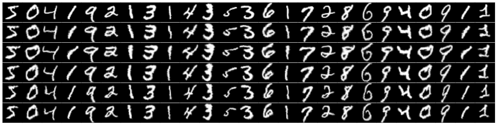

Reproducing MNIST results in [Ciresan 2012](http://arxiv.org/abs/1202.2745) with Theano
---

The code here builds on top of 3 supervised learning [theano tutorials](http://deeplearning.net/tutorial/) and another [library](https://github.com/rakeshvar/theanet) to implement the [best result](http://yann.lecun.com/exdb/mnist/) for classifying the famous mnist dataset at the time of writing.

The prediction process consists of:

- preprocessing
    - digit width normalization
    - elastic distortion of digits at train time
        - 
        - Multiple elastic distortions with sigma 8
- training DNN with SGD
    - 1x29x29-20C4-MP2-40C5-MP3-150N-10N
- testing with a committee of 35 Nets (5 nets per 7 choices of width normalization)

---

## Results:

*This figure shows the error in basis points on 10,000 test points from various combinations of trained network columns. The only difference between the 4 individual pictured columns is the normalized width of the training set, which progresses from 14 to 20, left to right, by 2. The best result pictured is an error of 59 basis points, i.e. an **error of 0.59%**. This figure was made by `venn_diagram.r`*

Counter-intuitively, a smaller normalized width improved results. Most likely, this is due to the increased effect of distortion on smaller digit sizes improving the quality of the trained net. We can investigate this effect further by raising alpha, or sigma for our training sets (especially the larger digit normalizations).

#### A table of various trials run:

| Batch Size | Norm. Width | Distortion Sigma | Distortion Alpha | # itr     | val err % | test err % | min | epochs |
|------------|-------------|------------------|------------------|-----------|-----------|------------|-----|--------|
| 300        | 20          | NA               | NA               | 274,000   | 2.34      | 2.64       | 118 | 547    |
| 1000       | 20          | NA               | NA               | NA        | NA        | 11         | 60  | NA     |
| 50         | 20          | 6                | 36               | 800,000   | 2.85      | 3.46       | 366 | 800    |
| 100        | 20          | 8                | 36               | 400,000   | 4.01      | 4.79       | 243 | 800    |
| 50         | 20          | 8                | 36               | 752,000   | 2.57      | 3.44       | 231 | 751    |
| 25         | 20          | 8                | 36               | 1,600,000 | 1.82      | 2.04       | 310 | 800    |
| 12         | 20          | 8                | 36               | 3,500,000 | 1.25      | 1.59       | 553 | 800    |
| 12         | 18          | 8                | 36               | 3,500,000 | 1.33      | 1.59       | 554 | 800    |
| 12         | 16          | 8                | 36               | 3,500,000 | 1.38      | 1.79       | 553 | 800    |
| 12         | 14          | 8                | 36               | 3,500,000 | 1.47      | 1.93       | 553 | 800    |

*Note: 1) the decrease in train time between data rows 4 and 5 although the batch size increased. This is due to switching to a faster convolutional implementation from [cuda-convnet](https://code.google.com/p/cuda-convnet/). 2) the high validation error with comparison to the test error, this is due to distortion being applied to the input data for validation but not test. 3) Error on smaller normalized width increases, since the fixed distortion params are more effective on the smaller images.*

## Hyper-parameters

### Sigma in elastic distortion

Distortions varying with sigma, first row is original normalized image, second row is sigma=9, last is sigma=5

### Memory Consumption via Batch size

#### Number Parameters

This model has 171,940 parameters (`1*20*4*4 + 20 + 20*40*5*5 + 40 + 5*5*40*150 + 150 + 150*10 + 10`).

#### Number activations

This model has 4,741 activations (`1*29*29 + 13*13*20 + 3*3*40 + 150 + 10`).

#### Memory and Batch size

Each image per batch should take up 0.706 MB of GPU memory, so our batch size is not constrained in this case.
